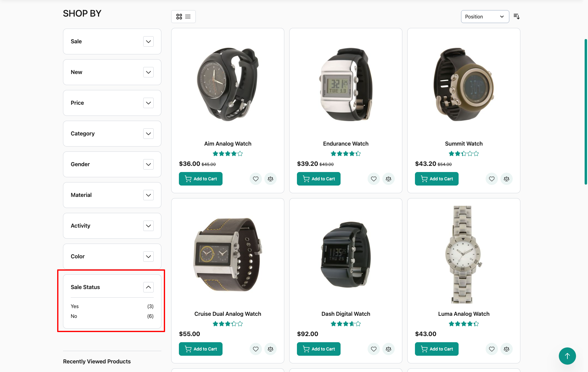

<!-- SEO Meta -->
<!--
  Title: Magento 2 Sale Filter Hyva Extension: On Sale Layered Navigation for Hyva Themes | Panth Infotech
  Description: Panth Sale Filter Hyva adds a native Alpine.js and Tailwind "On Sale" layered navigation filter to Hyva storefronts. Works alongside the core sale filter module. No jQuery. Expanded-by-default toggle in admin. Works on Magento 2.4.4 to 2.4.8 and PHP 8.1 to 8.4. Built by Top Rated Plus Magento developer Kishan Savaliya.
  Keywords: magento 2 sale filter hyva, hyva on sale filter, magento 2 layered navigation sale, hyva layered navigation, magento 2 sale badge filter, alpine js layered navigation, magento 2 on sale products filter, hyva sale filter extension, magento 2 sale products layered navigation, panth sale filter hyva
  Author: Kishan Savaliya (Panth Infotech)
  Canonical: https://kishansavaliya.com/magento-2-sale-filter-hyva.html
-->

# Magento 2 Sale Filter Hyva: On Sale Layered Navigation for Hyva Themes

[](https://magento.com)
[](https://php.net)
[](https://www.hyva.io)
[](https://kishansavaliya.com/magento-2-sale-filter-hyva.html)
[](https://packagist.org/packages/mage2kishan/module-sale-filter-hyva)
[](https://www.upwork.com/freelancers/~016dd1767321100e21)
[](https://kishansavaliya.com)

> **Give Hyva shoppers a fast, native "On Sale" filter in the layered navigation sidebar.** Panth Sale Filter Hyva adds an Alpine.js and Tailwind template for the sale filter, with no jQuery and no RequireJS. One admin toggle controls whether the filter renders open or collapsed on first paint.

**Product page:** [kishansavaliya.com/magento-2-sale-filter-hyva.html](https://kishansavaliya.com/magento-2-sale-filter-hyva.html)

---

## Quick Answer

**What is Panth Sale Filter Hyva?** It is the Hyva-native storefront layer for the Panth Sale Filter module. It replaces the default Luma/Knockout template with an Alpine.js and Tailwind version so the "On Sale" filter looks and behaves like the rest of your Hyva sidebar.

**What does it add to my store?**

- A **native Hyva template** for the "On Sale" layered navigation filter, built with Alpine.js and Tailwind, with no jQuery.
- An **Appearance (Hyva)** admin group under Sale Filter configuration with an "Expanded By Default" toggle.
- **FPC cache key variation** on the expanded/collapsed toggle, so admin changes bust the cached block correctly.

**Which themes are supported?** **Hyva** only. The core module `mage2kishan/module-sale-filter` covers Luma storefronts.

**What does it need?** Magento 2.4.4 to 2.4.8, PHP 8.1 to 8.4, Hyva 1.3+, the free `mage2kishan/module-core` package, and `mage2kishan/module-sale-filter` (the core module with the indexer, filter logic, and Luma template).

---

## Need Custom Magento 2 Development?

> **Get a free quote for your project in 24 hours** for custom modules, Hyva themes, performance work, M1 to M2 migrations, and Adobe Commerce Cloud.

<p align="center">
  <a href="https://kishansavaliya.com/get-quote">
    
  </a>
</p>

<table>
<tr>
<td width="50%" align="center">

### Kishan Savaliya
**Top Rated Plus on Upwork**

[](https://www.upwork.com/freelancers/~016dd1767321100e21)

100% Job Success • 10+ Years Magento Experience
Adobe Certified • Hyva Specialist

</td>
<td width="50%" align="center">

### Panth Infotech Agency
**Magento Development Team**

[](https://www.upwork.com/agencies/1881421506131960778/)

Custom Modules • Theme Design • Migrations
Performance • SEO • Adobe Commerce Cloud

</td>
</tr>
</table>

**Visit our website:** [kishansavaliya.com](https://kishansavaliya.com) &nbsp;|&nbsp; **Get a quote:** [kishansavaliya.com/get-quote](https://kishansavaliya.com/get-quote)

---

## Table of Contents

- [Who Is It For](#who-is-it-for)
- [Key Features](#key-features)
- [Screenshots](#screenshots)
- [Compatibility](#compatibility)
- [Installation](#installation)
- [Configuration](#configuration)
- [How It Works](#how-it-works)
- [Template Override](#template-override)
- [FAQ](#faq)
- [Support](#support)
- [About Panth Infotech](#about-panth-infotech)
- [Quick Links](#quick-links)

---

## Who Is It For

- **Hyva storefronts** that already use the Panth Sale Filter core module and need a matching Alpine.js template for the sidebar.
- **Developers building Hyva stores** who want the "On Sale" filter to look native, not like a Luma block dropped into a Hyva page.
- **Merchants** who want to control whether the sale filter renders open or collapsed without editing template files.
- **Stores running Magento Open Source or Adobe Commerce** on Hyva 1.3+, where Knockout and RequireJS templates are not a good fit.

---

## Key Features

### Native Hyva Template
- **Alpine.js and Tailwind markup** for the "On Sale" layered navigation filter, matching the style of every other Hyva sidebar filter.
- **No jQuery, no RequireJS, no Knockout** loaded by this module on the frontend.
- **Registered at** `Panth_SaleFilter::layer/filter/sale.phtml` so the active theme picks it up automatically when Hyva is detected.

### Admin Appearance Toggle
- **Expanded By Default** setting under *Stores -> Configuration -> Panth Extensions -> Sale Filter -> Appearance (Hyva)*.
- **Default is Yes (expanded)**, so the filter is open on first paint for new installs.
- **Store-scoped**: you can set a different state per store view.

### Full Page Cache Aware
- The filter renderer **varies its FPC cache key** on the expanded/collapsed setting, so changing the toggle in admin clears the right cached blocks without a full cache flush.

### Built on the Core Module
- All indexer logic, filter model, URL params, label config, discount-source switches, and Luma templates stay in `mage2kishan/module-sale-filter`. This module adds only the Hyva layer.
- **Clean DI**: one block class (`FilterRenderer`) injected through the layout, no ObjectManager.

---

## Screenshots

### Storefront sidebar



### Admin - configuration


### Admin - live demo


### Indexer registration (inherited from the core module)


---

## Compatibility

| Requirement | Versions Supported |
|---|---|
| Magento Open Source | 2.4.4, 2.4.5, 2.4.6, 2.4.7, 2.4.8 |
| Adobe Commerce | 2.4.4, 2.4.5, 2.4.6, 2.4.7, 2.4.8 |
| Adobe Commerce Cloud | 2.4.4 to 2.4.8 |
| PHP | 8.1.x, 8.2.x, 8.3.x, 8.4.x |
| Hyva Theme | 1.3+ |
| Required: core module | `mage2kishan/module-core` (free) |
| Required: sale filter | `mage2kishan/module-sale-filter` ^1.0.9 |

---

## Installation

### Composer Installation (Recommended)

```bash
# Pulls the core sale-filter module and module-core automatically.
composer require mage2kishan/module-sale-filter-hyva
bin/magento module:enable Panth_Core Panth_SaleFilter Panth_SaleFilterHyva
bin/magento setup:upgrade
bin/magento setup:di:compile
bin/magento indexer:reindex panth_salefilter_product
bin/magento setup:static-content:deploy -f
bin/magento cache:flush
```

### Manual Installation via ZIP

1. Download the latest release from [Packagist](https://packagist.org/packages/mage2kishan/module-sale-filter-hyva) or from the [product page](https://kishansavaliya.com/magento-2-sale-filter-hyva.html).
2. Extract it to `app/code/Panth/SaleFilterHyva/` in your Magento install.
3. Make sure `Panth_Core` and `Panth_SaleFilter` are installed too (required dependencies).
4. Run the commands above starting from `bin/magento module:enable`.

### Verify Installation

```bash
bin/magento module:status Panth_SaleFilterHyva
# Expected: Module is enabled
```

After install, open:
```
Admin -> Stores -> Configuration -> Panth Extensions -> Sale Filter -> Appearance (Hyva)
```

---

## Configuration

Go to **Stores -> Configuration -> Panth Extensions -> Sale Filter**.

| Setting | Group | Default | Description |
|---|---|---|---|
| Expanded By Default | Appearance (Hyva) | Yes | When enabled, the filter renders in its open state on first paint. Disable to render it collapsed until the shopper clicks the header. Store-scoped. |

All other settings (enable/disable, filter label, show product count, position, discount sources) are in the core module's *General* group. See the [core module README](https://github.com/mage2sk/module-sale-filter#readme) for that full list.

---

## How It Works

1. When a Hyva theme is active, Magento's layout system picks the template at `Panth_SaleFilter::layer/filter/sale.phtml` provided by this module.
2. The `FilterRenderer` block reads the **Expanded By Default** setting from config and passes it to the template.
3. The template uses Alpine.js `x-data` and `x-show` to handle open/close interaction and Tailwind classes for styling.
4. The block's FPC cache key includes the expanded/collapsed value, so the cached output is correct for each config state.
5. All indexing, filter matching, and URL handling is done by the core `Panth_SaleFilter` module, which runs regardless of the active theme.

---

## Template Override

To customise the markup without editing module files, copy the template into your Hyva child theme:

```
app/design/frontend/<YourVendor>/<YourHyvaChild>/Panth_SaleFilter/templates/layer/filter/sale.phtml
```

The module source is at:
```
view/frontend/templates/layer/filter/sale.phtml
```

---

## FAQ

### Does this module work without the core sale filter module?
No. This package is a Hyva compatibility layer only. It depends on `mage2kishan/module-sale-filter` for the indexer, filter logic, URL params, and Luma template. Composer will pull the core module for you automatically.

### Will it work on a Luma store?
No. This module is Hyva-only. For Luma, the core module `mage2kishan/module-sale-filter` already ships a Luma/Knockout template. You do not need this package for Luma.

### Does the "On Sale" filter work with Hyva's default layered navigation?
Yes. The template registers itself under the existing `Panth_SaleFilter` module namespace, so it slots into Hyva's sidebar the same way any other filter does.

### What does "Expanded By Default" actually control?
It sets the Alpine.js initial state for the filter accordion. When enabled, the filter list is visible on first paint. When disabled, shoppers must click the filter header to expand it. The FPC cache key is varied on this value, so the right state is served from cache.

### Can I set different expanded states per store view?
Yes. The field is store-scoped, so you can set it at default, website, or store view level in Stores -> Configuration.

### Does this module add any database tables?
No. All data is owned by the core `Panth_SaleFilter` module. This module adds only admin config fields and a frontend template.

### Is it translation ready?
Yes. All admin labels use Magento's translation pipeline, so you can override them in a language pack or `i18n/` CSV file.

### What happens if I remove this module?
Removing only this module reverts Hyva storefronts to the core module's Luma template, which works but is visually off-theme. Remove both packages to drop the sale filter entirely.

### Does Panth Sale Filter Hyva need Panth Core?
Yes. `mage2kishan/module-core` is a free, required dependency that Composer installs for you.

---

## Support

| Channel | Contact |
|---|---|
| Product Page | [kishansavaliya.com/magento-2-sale-filter-hyva.html](https://kishansavaliya.com/magento-2-sale-filter-hyva.html) |
| Email | kishansavaliyakb@gmail.com |
| Website | [kishansavaliya.com](https://kishansavaliya.com) |
| WhatsApp | +91 84012 70422 |
| GitHub Issues | [github.com/mage2sk/module-sale-filter-hyva/issues](https://github.com/mage2sk/module-sale-filter-hyva/issues) |
| Upwork (Top Rated Plus) | [Hire Kishan Savaliya](https://www.upwork.com/freelancers/~016dd1767321100e21) |
| Upwork Agency | [Panth Infotech](https://www.upwork.com/agencies/1881421506131960778/) |

Response time: 1-2 business days.

### Need Custom Magento Development?

Looking for **custom Magento module development**, **Hyva theme work**, **store migrations**, or **performance tuning**? Get a free quote in 24 hours:

<p align="center">
  <a href="https://kishansavaliya.com/get-quote">
    
  </a>
</p>

<p align="center">
  <a href="https://www.upwork.com/freelancers/~016dd1767321100e21">
    
  </a>
  &nbsp;&nbsp;
  <a href="https://www.upwork.com/agencies/1881421506131960778/">
    
  </a>
  &nbsp;&nbsp;
  <a href="https://kishansavaliya.com/magento-2-sale-filter-hyva.html">
    
  </a>
</p>

---

## About Panth Infotech

Built and maintained by **Kishan Savaliya** ([kishansavaliya.com](https://kishansavaliya.com)), a **Top Rated Plus** Magento developer on Upwork with 10+ years of eCommerce experience.

**Panth Infotech** is a Magento 2 development agency that builds high quality, security focused extensions and themes for both Hyva and Luma storefronts. The extension suite covers SEO, performance, checkout, product presentation, customer engagement, and store management, with each module built to MEQP standards and tested across Magento 2.4.4 to 2.4.8.

Browse the full extension catalog on our [Magento extensions page](https://kishansavaliya.com/magento-extensions.html) or on [Packagist](https://packagist.org/packages/mage2kishan/).

---

## Quick Links

| Resource | Link |
|---|---|
| **Product Page** | [magento-2-sale-filter-hyva.html](https://kishansavaliya.com/magento-2-sale-filter-hyva.html) |
| **Packagist** | [mage2kishan/module-sale-filter-hyva](https://packagist.org/packages/mage2kishan/module-sale-filter-hyva) |
| **GitHub** | [mage2sk/module-sale-filter-hyva](https://github.com/mage2sk/module-sale-filter-hyva) |
| **Website** | [kishansavaliya.com](https://kishansavaliya.com) |
| **Free Quote** | [kishansavaliya.com/get-quote](https://kishansavaliya.com/get-quote) |
| **Upwork (Top Rated Plus)** | [Hire Kishan Savaliya](https://www.upwork.com/freelancers/~016dd1767321100e21) |
| **Upwork Agency** | [Panth Infotech](https://www.upwork.com/agencies/1881421506131960778/) |
| **Email** | kishansavaliyakb@gmail.com |
| **WhatsApp** | +91 84012 70422 |

---

<p align="center">
  <strong>Ready to add a native On Sale filter to your Hyva store?</strong><br/>
  <a href="https://kishansavaliya.com/magento-2-sale-filter-hyva.html">
    
  </a>
</p>

---

**SEO Keywords:** magento 2 sale filter hyva, hyva on sale filter, magento 2 layered navigation sale, hyva layered navigation, magento 2 on sale products filter, alpine js layered navigation magento 2, magento 2 sale badge filter, hyva sale filter extension, magento 2 sale products sidebar filter, panth sale filter hyva, mage2kishan sale filter hyva, magento 2 hyva layered navigation extension, magento 2 sale filter alpine js, hyva theme layered navigation sale, magento 2 on sale layered navigation, magento 2 sale filter module hyva, magento 2.4.8 hyva sale filter, php 8.4 hyva sale filter, panth infotech, kishan savaliya magento, hire magento hyva developer, top rated plus upwork, custom magento development
