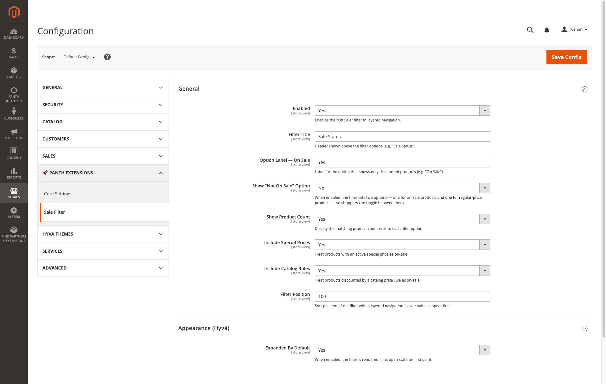

# Magento 2 Sale Filter Hyva

Hyva companion module for the Panth Sale Filter extension. It renders the options of the "On Sale" layered navigation filter with its own Tailwind CSS template inside the Hyva layered navigation, plus an admin setting that controls whether that filter opens expanded or collapsed. The indexer, filter logic and the filter itself are provided by the base module `mage2kishan/module-sale-filter`, which this package requires.

Product page: [Magento 2 Sale Filter Hyva](https://kishansavaliya.com/magento-2-sale-filter-hyva.html)

## Features

- Hyva template `Panth_SaleFilterHyva::layer/filter/sale.phtml` (list class `panth-salefilter-hyva`) for the sale filter options, styled with Tailwind CSS utility classes. It is wired in the Hyva layout handles `hyva_catalog_category_view` and `hyva_catalogsearch_result_index`, so it renders on Hyva category and search result pages. No jQuery or RequireJS code is shipped.
- The sale filter sits in the standard Hyva filter card, whose Alpine.js toggle opens and closes it like every other filter. All other filters keep the Hyva theme template.
- Block class `Panth\SaleFilterHyva\Block\LayeredNavigation\FilterRenderer`, which extends the base module's `Panth\SaleFilter\Block\LayeredNavigation\FilterRenderer` and adds `isDefaultExpanded()`.
- The block adds the expanded/collapsed state to its cache key, so each state is cached separately.
- One admin setting, "Expanded By Default", added to the base module's configuration section. Default: Yes. Configurable at default, website and store view scope.
- Filter items show the product count when the base module's count setting is enabled (`isShowCount()` from the base block).

## Compatibility

| Component | Supported |
|---|---|
| Magento Open Source | 2.4.4 to 2.4.8 |
| Adobe Commerce | 2.4.4 to 2.4.8 |
| PHP | 8.1, 8.2, 8.3, 8.4 (`~8.1.0 \|\| ~8.2.0 \|\| ~8.3.0 \|\| ~8.4.0`) |
| Themes | Hyva |

Composer constraints: `magento/framework` `^103.0`, `magento/module-catalog` `^104.0`, `magento/module-config` `^101.2`, `magento/module-store` `^101.1`, `hyva-themes/magento2-theme-module` `^1.3`, `hyva-themes/magento2-default-theme` `^1.3`.

## Requirements

Declared in `composer.json` (`require`):

- `mage2kishan/module-core` `^1.0` (module `Panth_Core`)
- `mage2kishan/module-sale-filter` `^1.1.0` (module `Panth_SaleFilter`, the base module; 1.1.0 adds the renderer plugin this module relies on)
- `magento/framework` `^103.0`, `magento/module-catalog` `^104.0`, `magento/module-config` `^101.2`, `magento/module-store` `^101.1`
- `hyva-themes/magento2-theme-module` `^1.3` (module `Hyva_Theme`)
- `hyva-themes/magento2-default-theme` `^1.3`

`etc/module.xml` loads this module after `Panth_Core`, `Panth_SaleFilter` and `Hyva_Theme`.

The base module does not require this package; it lists `mage2kishan/module-sale-filter-hyva` under `suggest`, as the source of the Hyva Alpine template and the Appearance admin group.

## Installation

```bash
composer require mage2kishan/module-sale-filter-hyva
bin/magento module:enable Panth_Core Panth_SaleFilter Panth_SaleFilterHyva
bin/magento setup:upgrade
bin/magento setup:di:compile   # production mode only
bin/magento cache:flush
```

Composer installs the base module and `mage2kishan/module-core` as dependencies. The module ships no `view/*/web` assets and no Tailwind configuration, so no static content deploy or Tailwind rebuild step is specific to this module.

Check that the module is enabled:

```bash
bin/magento module:status Panth_SaleFilterHyva
```

## Configuration

Stores > Configuration > Panth Extensions > Sale Filter > Appearance (Hyva)

The "Panth Extensions" tab comes from `Panth_Core` and the "Sale Filter" section from the base module; this module adds the "Appearance (Hyva)" group (the label in `system.xml` spells Hyva with an umlaut).

| Setting | Config path | Default | Scope | Description |
|---|---|---|---|---|
| Expanded By Default | `panth_salefilter/appearance/default_expanded` | Yes | Default, Website, Store View | When enabled, the sale filter card is open when the page loads. The other filters keep their own state. |

All other sale filter settings (enable, filter title, option labels and the rest) live in the base module's configuration. See [mage2kishan/module-sale-filter](https://github.com/mage2sk/module-sale-filter).



## Usage

The base module injects the "On Sale" filter into Magento's layered navigation filter list on category pages and search results, and a plugin on the layered navigation renderer draws the options of that filter with a module template.

On Hyva storefronts this module sets the renderer arguments `panth_salefilter_template` and `panth_salefilter_block` on `catalog.navigation.renderer` and `catalogsearch.navigation.renderer` in the layout handles `hyva_catalog_category_view` and `hyva_catalogsearch_result_index`. The Hyva layered navigation still draws the filter card (title, chevron and Alpine.js open/close toggle) for every filter; inside the sale filter card the option list comes from this module's template. The list shows the product count when the base module's Show Product Count setting is Yes. Other filters are not changed, and Luma store views on the same installation keep the base module's Luma template, because the `hyva_` handles are only added for Hyva themes.

When "Expanded By Default" is Yes, a small inline script in `before.body.end` (template `Panth_SaleFilterHyva::layer/filter/expand.phtml`) sets the initial `open` state of the sale filter card to true before Alpine.js starts. The script is registered with Hyva's CSP helper.

To change the markup, copy the template into your theme:

```
app/design/frontend/<Vendor>/<theme>/Panth_SaleFilterHyva/templates/layer/filter/sale.phtml
```


## Developer Notes

- Module name: `Panth_SaleFilterHyva`
- Composer package: `mage2kishan/module-sale-filter-hyva`
- PHP namespace: `Panth\SaleFilterHyva\`
- Classes: `Block\LayeredNavigation\FilterRenderer`, `Model\Config` (reads `panth_salefilter/appearance/default_expanded` at store scope)
- Templates: `view/frontend/templates/layer/filter/sale.phtml` (option list), `view/frontend/templates/layer/filter/expand.phtml` (Expanded By Default script)
- Layout: `view/frontend/layout/hyva_catalog_category_view.xml` and `view/frontend/layout/hyva_catalogsearch_result_index.xml`
- The module does not register with `hyva-themes/magento2-compat-module-fallback` and has no `di.xml`; the renderer plugin lives in the base module.
- The module adds no database tables, plugins, observers or cron jobs.

## Uninstallation

```bash
bin/magento module:disable Panth_SaleFilterHyva
composer remove mage2kishan/module-sale-filter-hyva
bin/magento setup:upgrade
bin/magento cache:flush
```

If a theme override references this module's template, remove it first. Removing this package leaves the base module installed.

## Support

- Product page: [Magento 2 Sale Filter Hyva](https://kishansavaliya.com/magento-2-sale-filter-hyva.html)
- Contact: [kishansavaliya.com/contact](https://kishansavaliya.com/contact)
- Email: kishansavaliyakb@gmail.com
- Issues: [GitHub issues](https://github.com/mage2sk/module-sale-filter-hyva/issues)

## License

Proprietary, as declared in `composer.json`. The package is published on Packagist and can be installed with Composer; see the product page for the terms of use.

## Changelog

See [CHANGELOG.md](CHANGELOG.md).

## Links

- Website: [kishansavaliya.com](https://kishansavaliya.com)
- All extensions catalogue: [Magento extensions](https://kishansavaliya.com/magento-extensions.html)
- GitHub: [mage2sk/module-sale-filter-hyva](https://github.com/mage2sk/module-sale-filter-hyva)
- Packagist: [mage2kishan/module-sale-filter-hyva](https://packagist.org/packages/mage2kishan/module-sale-filter-hyva)
- Base module: [mage2sk/module-sale-filter on GitHub](https://github.com/mage2sk/module-sale-filter), [mage2kishan/module-sale-filter on Packagist](https://packagist.org/packages/mage2kishan/module-sale-filter)
